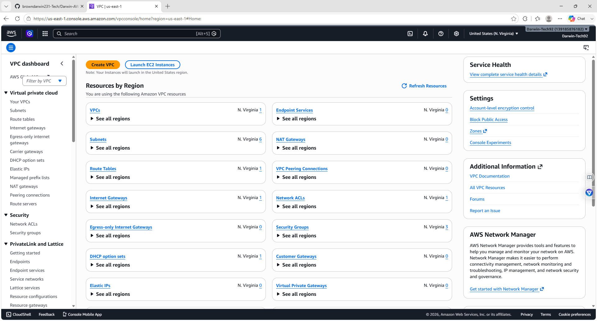
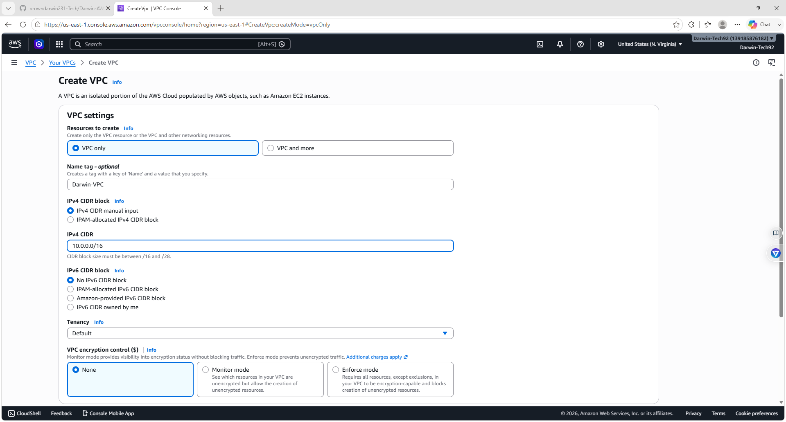
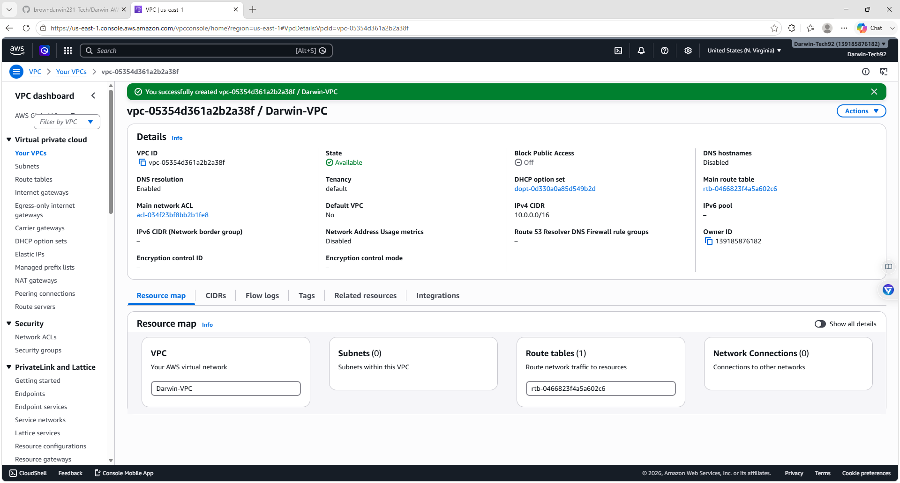
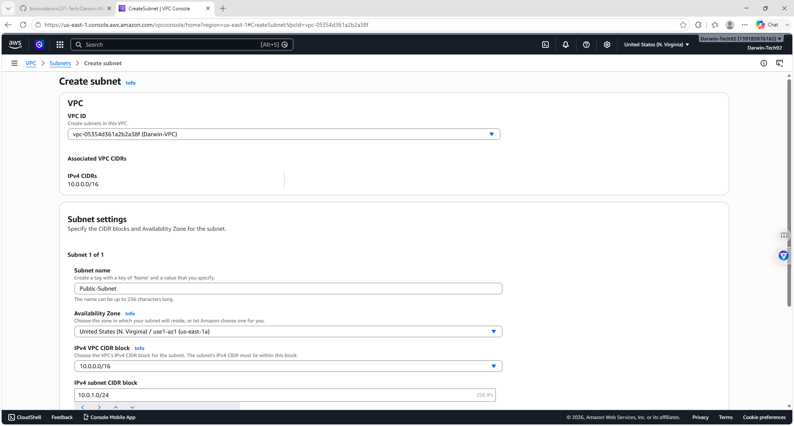
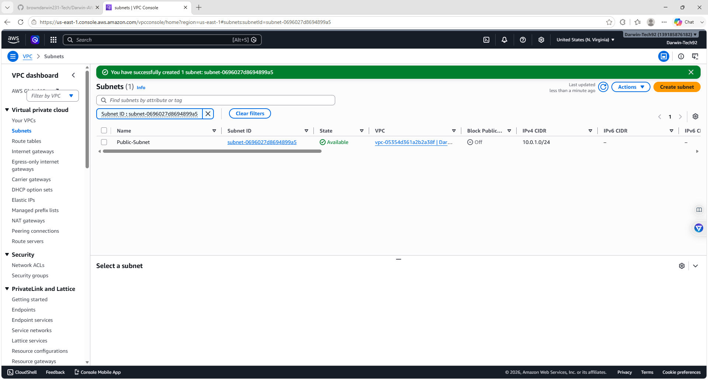
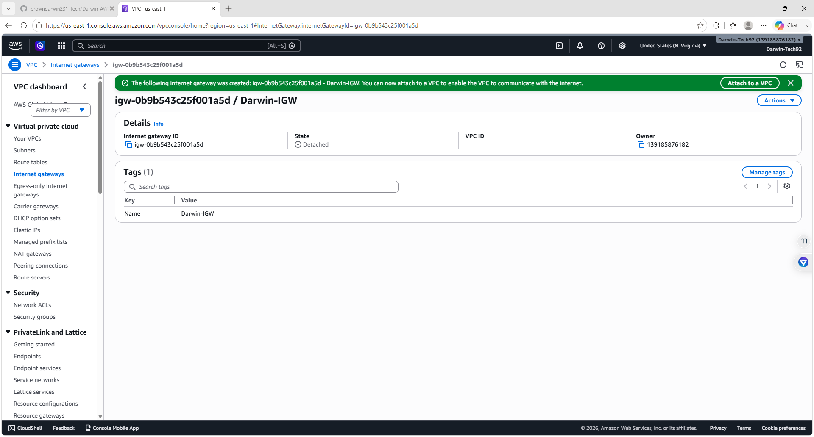
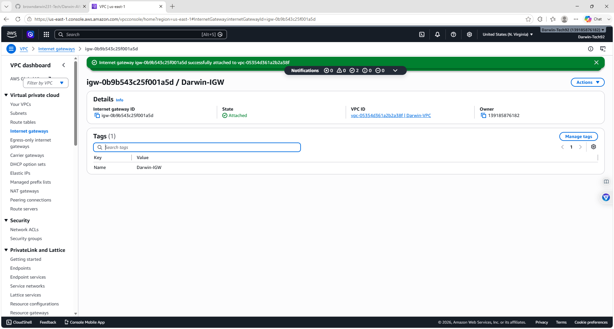
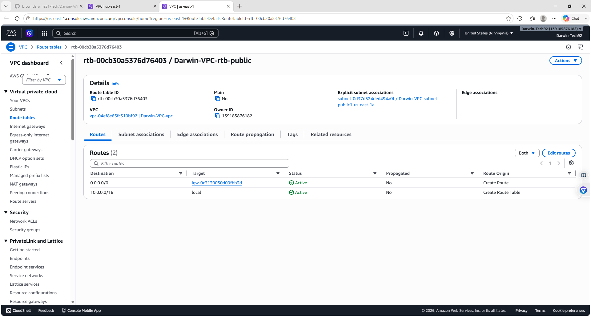
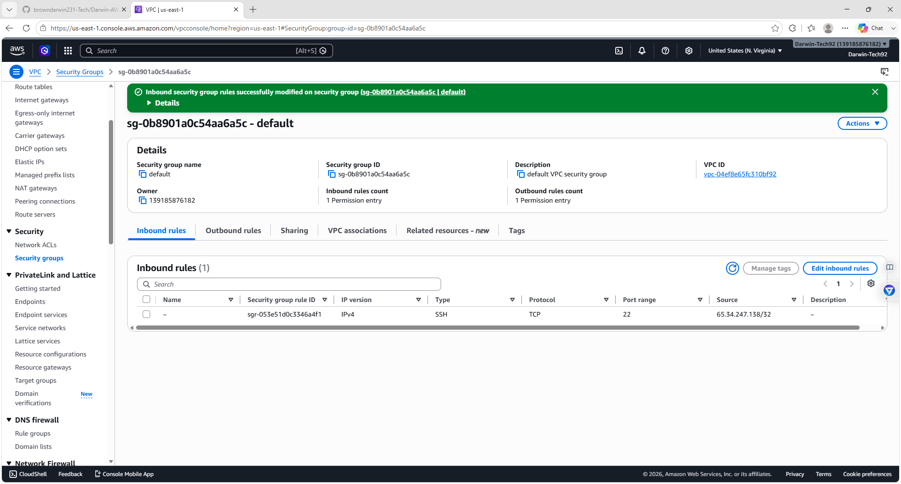
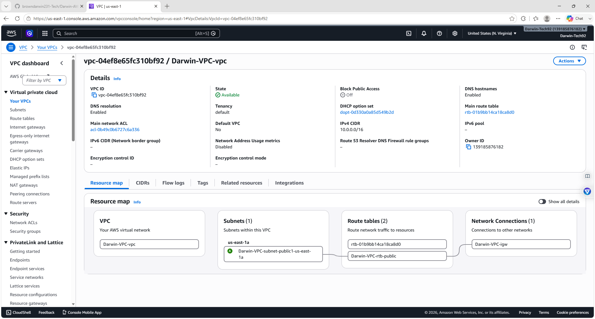

# Darwin-AWS-VPC-Networking-Lab
Hands-on AWS networking lab demonstrating VPC creation, public subnet configuration, Internet Gateway attachment, route table configuration, security group management, and VPC resource mapping using Amazon Web Services (AWS).

## Overview

This project demonstrates the creation and configuration of a secure AWS Virtual Private Cloud (VPC) using Amazon Web Services. The lab covers the core networking components required to build a functional cloud network, including subnets, Internet Gateways, route tables, and security groups.

The project follows AWS networking best practices while documenting each step with screenshots.

---

## Objectives

- Create a custom Amazon VPC
- Configure a public subnet
- Create and attach an Internet Gateway
- Configure public routing
- Configure Security Group inbound rules
- Verify network connectivity
- Document the complete VPC architecture

---

## Technologies Used

- Amazon Web Services (AWS)
- Amazon VPC
- Internet Gateway
- Route Tables
- Security Groups
- AWS Management Console

---

## Skills Demonstrated

- Cloud Networking
- AWS VPC Administration
- Public Subnet Configuration
- Internet Gateway Configuration
- Route Table Management
- Security Group Configuration
- Infrastructure Documentation

---

## Lab Architecture

The completed network includes:

- Custom VPC
- Public Subnet
- Internet Gateway
- Public Route Table
- Security Group
- VPC Resource Map

---

# Screenshots

## 1. VPC Dashboard

AWS VPC dashboard before creating networking resources.

---

## 2. Create VPC

Creating a new custom Virtual Private Cloud.

---

## 3. VPC Created

Successfully created the custom Darwin VPC.

---

## 4. Public Subnet

Creating a public subnet inside the VPC.

---

## 5. Subnet Created

Successfully created the public subnet.

---

## 6. Internet Gateway Created

Created an Internet Gateway for external connectivity.

---

## 7. Internet Gateway Attached

Attached the Internet Gateway to the custom VPC.

---

## 8. Route Table Updated

Configured the route table with a default route to the Internet Gateway.

---

## 9. Security Group Inbound Rules

Configured inbound SSH access using Security Groups.

---

## 10. VPC Summary

Overview of the completed AWS VPC architecture, including the VPC, subnet, route table, and Internet Gateway.

---

## What I Learned

During this lab I learned how to:

- Build a custom AWS Virtual Private Cloud
- Configure public networking
- Create and attach Internet Gateways
- Configure route tables for Internet access
- Manage Security Group rules
- Understand AWS networking architecture
- Document cloud infrastructure projects for a professional portfolio

---

## Author

**Darwin Brown**
